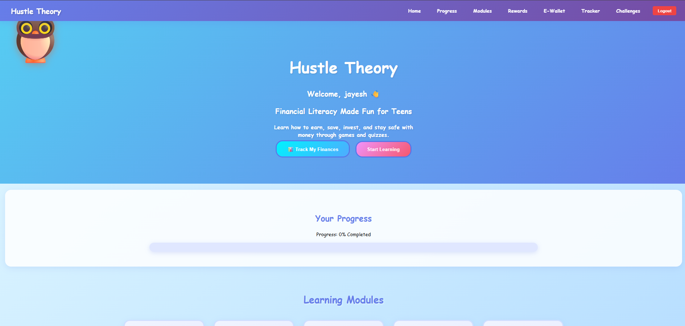
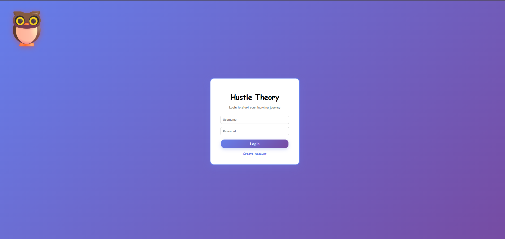
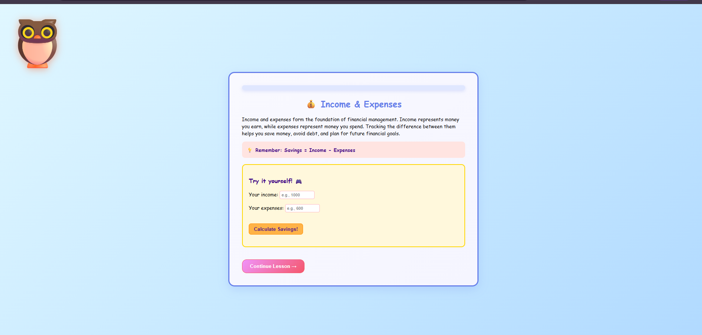
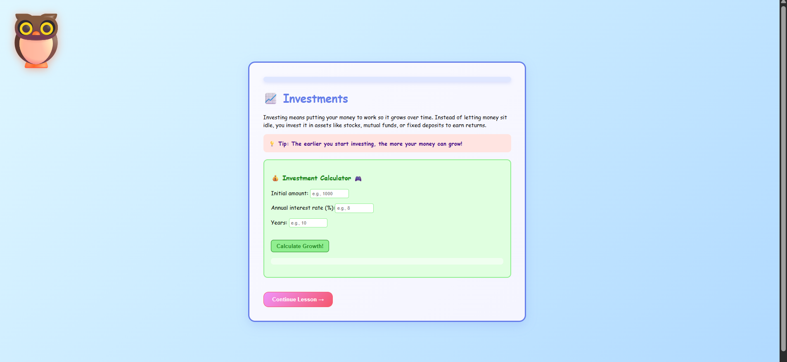
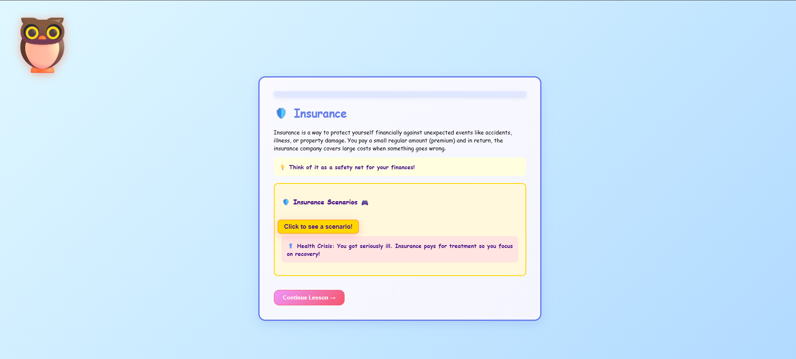
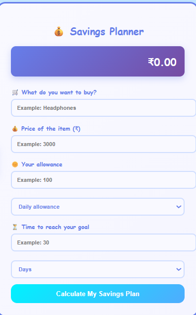
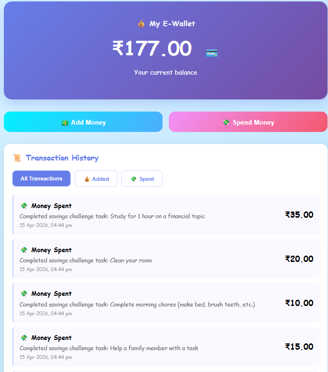
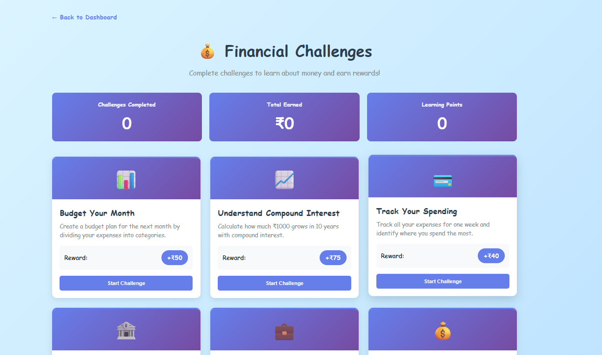
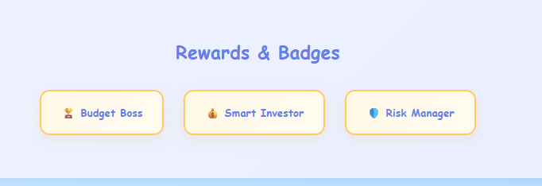
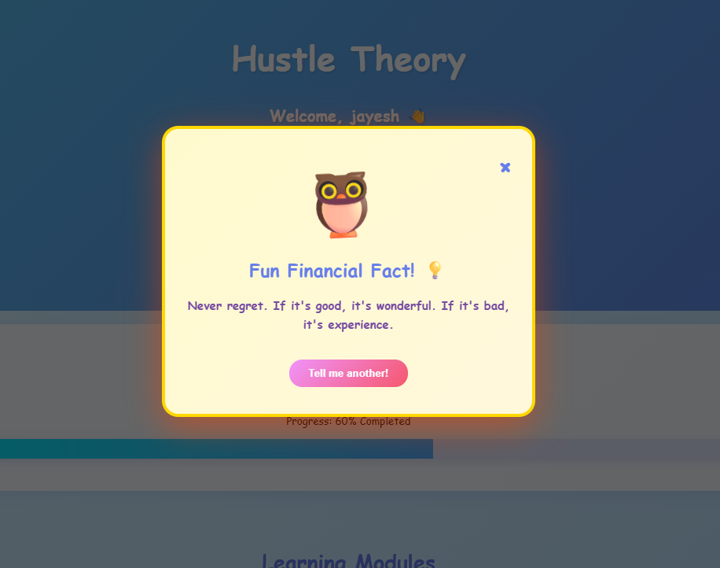

# 🎓 Hustle Theory - Financial Literacy for Teens

> A comprehensive web application teaching financial literacy to teenagers through interactive modules, quizzes, gamification, and real-world scenarios.

[](LICENSE)
[]()
[]()
[]()

---

## 📋 Table of Contents

- [Project Overview](#-project-overview)
- [Key Features](#-key-features)
- [Architecture & Design](#-architecture--design)
- [Modules & Content](#-modules--content)
- [APIs Integrated](#-apis-integrated)
- [Tech Stack](#-tech-stack)
- [Installation & Setup](#-installation--setup)
- [Project Structure](#-project-structure)
- [Challenges Faced](#-challenges-faced)
- [Team Contributions](#-team-contributions)
- [Screenshots & App Flow](#-screenshots--app-flow)
- [Future Enhancements](#-future-enhancements)
- [Contributing](#-contributing)

---

## 🎯 Project Overview

**Hustle Theory** is an educational platform designed to make financial literacy accessible and engaging for Indian teenagers (ages 13-19). The app uses interactive learning, gamification, real-world scenarios, and a friendly mascot (🦉 Smart Owl) to keep students motivated and engaged throughout their learning journey.

### Why This Project?

Financial literacy is crucial for teenagers, yet it's rarely taught in schools. This app bridges that gap by:

- Making finance **fun and relatable**
- Using **gamification** to maintain engagement
- Providing **interactive tools** (calculators, simulators)
- Offering **real-world scenarios** tailored to Indian context
- Tracking **progress** with badges and achievements

### Target Audience

- Students aged 13-19
- Parents wanting to teach kids financial concepts
- Schools looking for financial literacy curriculum
- Anyone interested in learning money management basics

---

## ✨ Key Features

### 1. **5 Interactive Learning Modules**

- 💰 **Module 1: Income & Expenses** - Budgeting & the 50-30-20 rule
- 📈 **Module 2: Investments** - Stocks, mutual funds, compound interest
- 🛡️ **Module 3: Insurance** - Types and importance of insurance
- 🧾 **Module 4: Taxes** - Income tax, GST, tax planning (Indian context)
- ⚠️ **Module 5: Financial Scams** - Identifying fraud & staying safe

### 2. **💰 Financial Challenges System**

- 📚 **12 Interactive Challenges** - Real-world financial tasks across 4 categories:
  - **Budgeting**: Budget planning, spending tracking, smart shopping
  - **Investing**: Compound interest, investment comparison, diversification
  - **Saving**: Emergency funds, debt payoff, EMI calculation
  - **Learning**: Net worth, inflation, scam identification
- 💵 **Earn While Learning** - Get ₹40-₹90 rewards per completed challenge
- 📊 **Progress Tracking** - Track challenges completed, total earned, learning points
- 🎓 **No Target Amount** - Complete challenges at your own pace, learn what interests you

### 3. **Gamification System**

- 🏆 **Badge System** - Earn badges for completing modules
- 📊 **Progress Tracking** - Visual progress bars and completion percentage
- 🎯 **Module Unlocking** - Unlock new modules as you progress
- ⭐ **Achievement System** - Special badges for completing all modules

### 4. **Interactive Tools**

- 📊 **Investment Simulator** - Calculate compound interest returns
- 🧮 **Tax Calculator** - Estimate income tax based on Indian slabs
- 💾 **Savings Goal Planner** - Plan savings for future goals
- 🦉 **Smart Owl Mascot** - Provides encouragement and wisdom
- 💰 **E-Wallet System** - Track earnings and balance

### 5. **Smart Features**

- 🔐 **User Authentication** - Secure login/registration
- 💾 **Progress Persistence** - Save progress to database
- 📱 **Responsive Design** - Works on desktop and mobile
- 🎨 **Beautiful UI** - Modern purple/blue gradient theme
- 📲 **Real-time API Integration** - Live advice & quotes from external APIs

---

## 🏗️ Architecture & Design

### **System Architecture**

```
┌─────────────────────────────────────────────────┐
│         Frontend (HTML/CSS/JavaScript)          │
│  ├─ Auth Pages (Login/Register)                │
│  ├─ Dashboard (Progress, Modules, Badges)      │
│  ├─ Module Pages (Learning + Quizzes)          │
│  ├─ Tracker (Savings Goal Planner)             │
│  └─ Smart Owl Modal (API Integration)          │
└────────────┬────────────────────────────────────┘
             │
             ↓ HTTP Requests (JSON)
┌─────────────────────────────────────────────────┐
│       Backend (Flask REST API)                  │
│  ├─ /api/register - User registration         │
│  ├─ /api/login - User authentication           │
│  ├─ /api/progress - Track module completion   │
│  ├─ /api/savings - Manage savings goals        │
│  ├─ /api/badges - Award achievements          │
│  └─ /api/* - Other endpoints                  │
└────────────┬────────────────────────────────────┘
             │
             ↓ SQL Queries
┌─────────────────────────────────────────────────┐
│      Database (SQLite3)                         │
│  ├─ users table                                │
│  ├─ user_progress table                        │
│  ├─ savings_goals table                        │
│  ├─ badges table                               │
│  └─ Persistent data storage                    │
└─────────────────────────────────────────────────┘
```

### **Design Patterns Used**

1. **MVC Pattern** - Separation of Model (DB), View (Frontend), Controller (Flask Routes)
2. **RESTful API Design** - Standard HTTP methods (GET, POST)
3. **Client-Server Architecture** - Decoupled frontend and backend
4. **Module-Based Structure** - Each module is independent and self-contained
5. **Progressive Enhancement** - Works with or without server

### **Technology Stack**

**Frontend:**

- HTML5 (Semantic markup)
- CSS3 (Gradients, animations, flexbox)
- Vanilla JavaScript (No frameworks)

**Backend:**

- Python 3.8+
- Flask (Lightweight web framework)
- SQLite3 (File-based database)

**External APIs:**

- 🔗 **Advice Slip API** - Random wisdom & advice with content filtering

---

## 📚 Modules & Content

### **Module 1: Income & Expenses** 💰

**Learning Objectives:**

- Understand sources of income
- Identify fixed and variable expenses
- Learn the 50-30-20 budgeting rule
- Create a personal budget

**Components:**

- Interactive lessons with scenarios
- The 50-30-20 Rule visualization
- Budget planning worksheet
- Quiz with 5 questions
- Achievement: 🏆 Budget Boss Badge

---

### **Module 2: Investments** 📈

**Learning Objectives:**

- Understand stocks and mutual funds
- Learn about compound interest
- Calculate investment returns
- Understand risk vs reward

**Components:**

- Stock market basics lesson
- Investment Simulator (interactive calculator)
- Compound interest visualization
- Real-world examples
- Quiz with 5 questions
- Achievement: 💰 Smart Investor Badge

---

### **Module 3: Insurance** 🛡️

**Learning Objectives:**

- Types of insurance (health, life, vehicle, home)
- Why insurance is important
- How insurance works
- Coverage and premiums

**Components:**

- Insurance types explained
- Risk management scenarios
- Insurance claim process
- Real-life case studies
- Quiz with 5 questions
- Achievement: 🛡️ Risk Manager Badge

---

### **Module 4: Taxes** 🧾

**Learning Objectives:**

- Understand income tax
- Learn about GST (Goods & Services Tax)
- Tax slabs in India
- Tax planning strategies

**Components:**

- Indian tax system overview
- Tax Calculator (interactive)
- Different tax slabs
- Deductions and exemptions
- Quiz with 5 questions
- Achievement: 🧾 Tax Ninja Badge

---

### **Module 5: Financial Scams** ⚠️

**Learning Objectives:**

- Identify common scams
- Phishing and fraud awareness
- Online safety practices
- How to report scams

**Components:**

- Common scam types (with real examples)
- Red flags to watch for
- Online safety checklist
- How to report scams
- Quiz with 5 questions
- Achievement: 🛡️ Scam Shield Badge

---

## 🔗 APIs Integrated

### **1. Advice Slip API**

- **Purpose:** Provide random wisdom and advice to keep students motivated
- **Endpoint:** `https://api.adviceslip.com/advice`
- **Usage:** When user clicks the Smart Owl mascot
- **Response Format:**
  ```json
  {
    "slip": {
      "advice": "The best time to plant a tree was 20 years ago. The second best time is now."
    }
  }
  ```

### **2. Content Filtering System**

- **Custom Implementation:** Kid-safe content filter
- **Features:**
  - Filters 40+ inappropriate words
  - Checks content length
  - Retries up to 5 times for clean advice
  - Falls back to curated list if needed
  - 100% safe for teenagers

### **3. Backend API Endpoints**

| Endpoint                  | Method | Purpose                           |
| ------------------------- | ------ | --------------------------------- |
| `/api/register`           | POST   | User registration                 |
| `/api/login`              | POST   | User login                        |
| `/api/progress/<user_id>` | GET    | Fetch user progress               |
| `/api/progress`           | POST   | Update module completion          |
| `/api/savings/<user_id>`  | GET    | Get savings goals                 |
| `/api/savings`            | POST   | Create new savings goal           |
| `/api/badges/<user_id>`   | GET    | Fetch user badges                 |
| `/api/badges`             | POST   | Award badge to user               |
| `/api/wallet/<user_id>`   | GET    | Get wallet balance & transactions |
| `/api/wallet/add`         | POST   | Add money to wallet               |
| `/api/wallet/spend`       | POST   | Spend money from wallet           |

---

## 🛠️ Tech Stack

| Layer        | Technology           | Purpose                   |
| ------------ | -------------------- | ------------------------- |
| **Frontend** | HTML5                | Semantic structure        |
|              | CSS3                 | Styling & animations      |
|              | JavaScript (Vanilla) | Interactivity & API calls |
| **Backend**  | Python 3             | Server logic              |
|              | Flask                | Web framework             |
|              | SQLite3              | Database                  |
| **External** | Advice Slip API      | Dynamic wisdom content    |
| **DevTools** | Git                  | Version control           |
|              | VS Code              | Development               |

---

## 📦 Installation & Setup

### **Prerequisites**

- Python 3.8 or higher
- pip (Python package manager)
- Modern web browser
- Git (optional, for cloning)

### **Step 1: Clone Repository**

```bash
git clone https://github.com/jayesh-s-patil/hustle-theory.git
cd hustle-theory
```

### **Step 2: Install Dependencies**

```bash
pip install -r requirements.txt
```

### **Step 3: Start the Flask Server**

```bash
python app.py
```

Server runs on `http://localhost:5000`

### **Step 4: Open Application**

- **API Info:** `http://localhost:5000`
- **Dashboard:** Open `index.html` in browser (after login)
- **Login Page:** Open `auth.html` in browser

### **Step 5: Create Test Account**

- Go to auth.html
- Register with username & password
- Login with your credentials
- Start learning! 🎉

### **Step 6: Inspect Database (Optional)**

```bash
python inspect_db.py
```

Shows database tables, columns, and sample data.

---

## 📂 Project Structure

```
hustle-theory/
│
├── 📄 README.md                    # Main documentation
├── 📄 app.py                       # Flask backend server
├── 📄 inspect_db.py               # Database inspection tool
├── 📄 requirements.txt             # Python dependencies
│
├── 📄 HTML Pages (Frontend)
│   ├── index.html                 # Dashboard/Home page
│   ├── auth.html                  # Login & Registration
│   ├── challenge.html             # Financial Challenges (NEW)
│   ├── wallet.html                # E-Wallet System
│   └── tracker.html               # Savings Goal Tracker
│
├── 📚 modules/ (Learning Content)
│   ├── module1.html               # Income & Expenses
│   ├── module2.html               # Investments
│   ├── module3.html               # Insurance
│   ├── module4.html               # Taxes
│   └── module5.html               # Financial Scams
│
├── 🎨 assets/
│   ├── css/
│   │   └── style.css              # All styling (purple/blue theme)
│   │
│   └── js/
│       ├── auth.js                # Login/Registration logic
│       ├── dashboard.js           # Dashboard functionality
│       ├── challenge.js           # Challenge system logic (NEW)
│       ├── tracker.js             # Savings tracker logic
│       ├── module1.js             # Module 1 quiz logic
│       ├── module2.js             # Module 2 simulator
│       ├── module3.js             # Module 3 scenarios
│       ├── module4.js             # Module 4 tax calculator
│       └── module5.js             # Module 5 scam detection
│
├── 📸 images/ (Screenshots & Visual Assets)
│   ├── auth.png                   # Authentication page screenshot
│   ├── dashboard.png              # Dashboard screenshot
│   ├── molude1.png                # Module 1 screenshot
│   ├── module2.png                # Module 2 (Investments) screenshot
│   ├── module3.png                # Module 3 (Insurance) screenshot
│   ├── calculator.png             # Tax Calculator screenshot
│   ├── challenges.png             # Challenges page screenshot
│   ├── ewallet.png                # E-Wallet screenshot
│   ├── badges.png                 # Badges system screenshot
│   └── advice.png                 # Advice API modal screenshot
│
├── 🗄️ hustle_theory.db            # SQLite database (auto-created)
│
└── .git/                          # Git version control

```

### **Image Directory**

All images are stored in `images/` at the root level:

- **auth.png**: Authentication/Login page
- **dashboard.png**: Main dashboard view
- **molude1.png**: Module 1 - Income & Expenses
- **module2.png**: Module 2 - Investments Simulator
- **module3.png**: Module 3 - Insurance
- **calculator.png**: Module 4 - Tax Calculator
- **challenges.png**: Financial Challenges page
- **ewallet.png**: E-Wallet system
- **badges.png**: Badge achievements
- **advice.png**: Advice/Fun Facts modal

**How to use images in HTML:**

```html


```

### **Users Table**

```sql
CREATE TABLE users (
    id INTEGER PRIMARY KEY AUTOINCREMENT,
    username TEXT UNIQUE NOT NULL,
    password TEXT NOT NULL,
    created_at TIMESTAMP DEFAULT CURRENT_TIMESTAMP
);
````

### **User Progress Table**

```sql
CREATE TABLE user_progress (
    id INTEGER PRIMARY KEY AUTOINCREMENT,
    user_id INTEGER NOT NULL,
    module_id INTEGER NOT NULL,
    completed BOOLEAN DEFAULT 0,
    score INTEGER DEFAULT 0,
    completed_at TIMESTAMP,
    FOREIGN KEY (user_id) REFERENCES users(id),
    UNIQUE(user_id, module_id)
);
```

### **Savings Goals Table**

```sql
CREATE TABLE savings_goals (
    id INTEGER PRIMARY KEY AUTOINCREMENT,
    user_id INTEGER NOT NULL,
    item_name TEXT NOT NULL,
    target_price REAL NOT NULL,
    allowance REAL NOT NULL,
    allowance_type TEXT NOT NULL,
    time_value INTEGER NOT NULL,
    time_type TEXT NOT NULL,
    created_at TIMESTAMP DEFAULT CURRENT_TIMESTAMP,
    FOREIGN KEY (user_id) REFERENCES users(id)
);
```

### **Badges Table**

```sql
CREATE TABLE badges (
    id INTEGER PRIMARY KEY AUTOINCREMENT,
    user_id INTEGER NOT NULL,
    badge_name TEXT NOT NULL,
    earned_at TIMESTAMP DEFAULT CURRENT_TIMESTAMP,
    FOREIGN KEY (user_id) REFERENCES users(id)
);
```

---

## 🚀 Features Breakdown

### **Authentication System**

- ✅ User registration with username & password
- ✅ Secure login validation
- ✅ Session management with localStorage
- ✅ Logout functionality

### **Progress Tracking**

- ✅ Track completion for each of 5 modules
- ✅ Calculate overall progress percentage
- ✅ Visual progress bar on dashboard
- ✅ Persistent storage in database

### **Badge & Achievement System**

- ✅ Award badges for each module completion
- ✅ Special badge for completing all modules
- ✅ Display badges on dashboard
- ✅ Celebrate achievements with animations

### **Interactive Tools**

- ✅ Investment Simulator (compound interest calculator)
- ✅ Tax Calculator (Indian tax slabs)
- ✅ Savings Goal Planner (track financial goals)
- ✅ Budget Planner (50-30-20 rule)

### **User Experience**

- ✅ Responsive design (desktop & mobile)
- ✅ Smooth animations & transitions
- ✅ Friendly 🦉 Smart Owl mascot
- ✅ Beautiful purple/blue color scheme
- ✅ Intuitive navigation

### **External Integration**

- ✅ Advice Slip API for dynamic wisdom
- ✅ Content filtering for kid safety
- ✅ Error handling & fallbacks

---

## ⚠️ Challenges Faced During Development

### **1. Database Management** 🗄️

**Challenge:** Managing SQLite database with proper foreign key relationships  
**Solution:** Used PRAGMA foreign_keys and proper schema design with UNIQUE constraints

### **2. Authentication & Security** 🔐

**Challenge:** Storing passwords securely and managing sessions  
**Solution:** Implemented client-side session management with localStorage (note: for production, use bcrypt hashing and JWT tokens)

### **3. API Integration** 🔗

**Challenge:** Handling rate limits and inappropriate content from Advice Slip API  
**Solution:** Implemented retry logic (5 attempts) and content filtering with 40+ banned word checks

### **4. Responsive Design** 📱

**Challenge:** Making the app work seamlessly across devices  
**Solution:** Used CSS flexbox, gradients, and tested on multiple screen sizes

### **5. Progress Tracking** 📊

**Challenge:** Syncing progress between frontend (localStorage) and backend (database)  
**Solution:** Implemented dual-source approach - uses server data when available, falls back to localStorage

### **6. Content Filtering** 🛡️

**Challenge:** Ensuring all content is age-appropriate for teenagers  
**Solution:** Built custom keyword filtering with retry logic and curated fallback list

### **7. Module Unlocking Logic** 🔐

**Challenge:** Ensuring modules unlock progressively based on completion  
**Solution:** Frontend validation checking completed_modules count before allowing access

### **8. Cross-Origin Requests** 🌐

**Challenge:** Making API calls to external services from browser  
**Solution:** Used CORS-enabled public APIs (no authentication needed)

---

## 👥 Team Contributions

### **Pranav** 🎨

**Role:** Frontend Structure & HTML  
**Contributions:**

- Created main HTML structure for all pages
- Built navigation and layout framework
- Designed page hierarchy and semantic markup
- Created responsive container structures
- Integrated all CSS classes and IDs
- Ensured consistent page structure across all modules

**Key Files:**

- `index.html` - Dashboard structure
- `auth.html` - Login/Registration pages
- `tracker.html` - Savings tracker layout
- `modules/*.html` - All module pages

---

### **Jayesh** ⚙️

**Role:** Backend, APIs, Database & DOM Manipulation  
**Contributions:**

- Built Flask backend server with all endpoints
- Designed SQLite database schema
- Implemented user authentication (register/login)
- Created progress tracking API
- Built savings goals management
- Implemented badge system
- Integrated Advice Slip API with content filtering
- DOM manipulation for dynamic content updates
- Created `inspect_db.py` tool for database inspection
- Handled error management and fallback systems

**Key Files:**

- `app.py` - Complete backend implementation
- `inspect_db.py` - Database inspection tool
- All API endpoint logic
- Content filtering system

---

### **Sufiyan** 📚

**Role:** Content Creation & Educational Design  
**Contributions:**

- Written all educational content for 5 modules
- Created module lessons and explanations
- Designed and developed quiz questions
- Written scenario-based case studies
- Created module notes and summaries
- Indian context for financial concepts
- Age-appropriate language and examples
- Real-world scenarios for relevance

**Key Files:**

- Content in `modules/*.html` (all lessons)
- Quiz questions and answers
- Case studies and real-world examples
- Module notes and summaries

---

### **Sahil** 🎨

**Role:** UI/UX Design & Documentation  
**Contributions:**

- Designed the beautiful purple/blue color scheme
- Created CSS styling (`style.css`) - 950+ lines
- Designed animations and transitions
- Created responsive layouts
- Built Smart Owl mascot animations
- Designed badge system UI
- Created progress bar animations
- Button and modal styling
- Complete documentation and README
- API documentation
- Integration guides
- Created this comprehensive README

**Key Files:**

- `assets/css/style.css` - Complete styling
- All visual design elements
- Animation keyframes
- Color scheme and gradients
- Documentation files

---

## 📸 Screenshots & App Flow

### **App Flow Diagram**

```
┌─────────────────────┐
│   User Visits App   │
└──────────┬──────────┘
           │
           ↓
    ┌──────────────┐
    │  auth.html   │
    │ Login/Signup │
    └──────┬───────┘
           │
    ┌──────▼───────────┐
    │  Authentication  │
    │    Validation    │
    └──────┬───────────┘
           │
    ┌──────▼────────────────┐
    │   index.html          │
    │   Dashboard           │
    │  - Show Progress      │
    │  - List Modules       │
    │  - Show Badges        │
    │  - Owl Mascot         │
    └──────┬────────────────┘
           │
    ┌──────▼──────────────────────────────────────┐
    │  User Selects Module (1-5)                  │
    │  └─→ modules/moduleX.html                   │
    │      ├─ Lesson content                      │
    │      ├─ Interactive tools (calculators)    │
    │      ├─ Quiz questions                      │
    │      └─ Complete → Award badge              │
    │                                              │
    │  Or Selects "Track Finances"                │
    │  └─→ tracker.html                           │
    │      ├─ Create savings goals                │
    │      ├─ Track progress                      │
    │      └─ Calculate time to goal              │
    │                                              │
    │  Or Clicks Owl Mascot                       │
    │  └─→ Modal Popup                            │
    │      └─ Advice Slip API → Random advice    │
    └──────┬──────────────────────────────────────┘
           │
    ┌──────▼────────────┐
    │  Progress Updated │
    │  Badges Earned    │
    │  Modules Unlocked │
    └────────────────────┘
```

### **Key Screenshots** 📷

1. **Authentication Page** (`auth.html`)
   
   - Login form with gradient background
   - Switch between login/signup
   - Input validation

2. **Dashboard** (`index.html`)
   
   - Welcome message
   - Progress bar showing completion %
   - 5 module cards with lock/unlock status
   - Badges section
   - Smart Owl mascot (top-left)

3. **Module 1: Income & Expenses** (`modules/module1.html`)
   
   - Module title and introduction
   - Lesson content with explanations
   - Interactive tools/calculators
   - Quiz questions

4. **Module 2: Investments Simulator** (`modules/module2.html`)
   
   - Input fields (principal, rate, years)
   - Calculate button
   - Result display with formatted currency
   - Visual representation

5. **Module 3: Insurance** (`modules/module3.html`)
   
   - Insurance types explained
   - Risk management scenarios
   - Interactive content

6. **Module 4: Tax Calculator** (`modules/module4.html`)
   
   - Income input field
   - Tax calculation display
   - Tax slab breakdown
   - Net income after tax

7. **E-Wallet System** (`wallet.html`)
   
   - Wallet balance display
   - Transaction history
   - Money earned from challenges
   - Balance tracking

8. **Financial Challenges** (`challenge.html`)
   
   - 12 interactive challenges
   - Challenge categories (Budgeting, Investing, Saving, Learning)
   - Earn ₹40-₹90 per challenge
   - Progress stats dashboard

9. **Badge System** (`index.html`)
   
   - 6 badges displayed
   - Special "Hustle Master" for completing all
   - Badge celebration animation

10. **Advice Slip API Modal**
    
    - Animated owl mascot
    - "Fun Financial Fact!" heading
    - Advice text from API
    - "Tell me another!" button

---

## 🎓 Educational Impact

### **Learning Outcomes**

Students will be able to:

- ✅ Create personal budgets using the 50-30-20 rule
- ✅ Calculate compound interest and investment returns
- ✅ Understand different types of insurance
- ✅ Calculate income tax based on Indian slabs
- ✅ Identify and avoid financial scams
- ✅ Set and achieve financial goals
- ✅ Make informed financial decisions

### **Engagement Metrics**

- 🎯 **Gamification** keeps students motivated
- 🦉 **Mascot Character** makes learning fun
- 🏆 **Badge System** provides tangible rewards
- 📊 **Progress Tracking** shows visible achievement
- 🎨 **Beautiful UI** maintains engagement

---

## 🚀 Future Enhancements

- [ ] Password hashing (bcrypt) for security
- [ ] JWT token-based authentication
- [ ] Leaderboard system (compare with peers)
- [ ] Mobile app using React Native
- [ ] Real-time multiplayer quizzes
- [ ] Progress visualization charts
- [ ] Email notifications for milestones
- [ ] Difficulty levels (Easy, Medium, Hard)
- [ ] More modules (credit cards, retirement, investments)
- [ ] Integration with real stock market APIs
- [ ] Admin panel for teacher management
- [ ] Certificate generation for completion
- [ ] Parental dashboard to track student progress
- [ ] Gamification shop (earn points for rewards)
- [ ] Multilingual support (Hindi, regional languages)

---

## 📖 Documentation Files

- **DATABASE_README.md** - Complete API endpoint documentation
- **INTEGRATION_GUIDE.md** - Frontend-backend integration guide
- **MODULE_UPDATES.md** - Module structure and quiz details

---

## 🛡️ Security Notes

### **Current Implementation (Development)**

- Basic password storage
- Client-side session management with localStorage
- No HTTPS

### **Recommended for Production**

- ✅ Password hashing with bcrypt
- ✅ JWT token-based authentication
- ✅ HTTPS encryption
- ✅ Input validation and sanitization
- ✅ SQL injection prevention (use parameterized queries - already implemented)
- ✅ Rate limiting on API endpoints
- ✅ CORS configuration

---

## 📝 License

This project is licensed under the MIT License - see the LICENSE file for details.

---

## 🤝 Contributing

Contributions are welcome! To contribute:

1. Fork the repository
2. Create a feature branch (`git checkout -b feature/AmazingFeature`)
3. Commit changes (`git commit -m 'Add AmazingFeature'`)
4. Push to branch (`git push origin feature/AmazingFeature`)
5. Open a Pull Request

---

## 📞 Contact & Support

- **Project Lead:** Jayesh (Backend)
- **Design Lead:** Sahil (UI/UX)
- **Email:** hustle.theory.edu@gmail.com
- **GitHub Issues:** Report bugs and suggest features

---

## 🙏 Acknowledgments

- **Advice Slip API** - For providing random wisdom
- **Flask Community** - For the lightweight web framework
- **Stack Overflow** - For community support
- **All Contributors** - For their dedication to this project

---

## 📊 Project Statistics

| Metric                     | Value                    |
| -------------------------- | ------------------------ |
| **Total Lines of Code**    | ~5000+                   |
| **HTML Files**             | 8                        |
| **CSS Lines**              | 950+                     |
| **JavaScript Lines**       | 1500+                    |
| **Python Lines (Backend)** | 300+                     |
| **Modules**                | 5                        |
| **Quiz Questions**         | 25+                      |
| **API Endpoints**          | 8                        |
| **Badges**                 | 6                        |
| **Team Members**           | 4                        |
| **Development Time**       | College Semester Project |

---

## 🎓 Made with ❤️ for Financial Literacy

**Hustle Theory** - Teaching teens the power of money management, one lesson at a time.

**Last Updated:** April 2026  
**Version:** 1.0.0  
**Status:** ✅ Active & Maintained

---

### Quick Links

- 📚 [Documentation](docs/)
- 🐛 [Report a Bug](https://github.com/jayesh-s-patil/hustle-theory/issues)
- ✨ [Request Feature](https://github.com/jayesh-s-patil/hustle-theory/issues)
- 🌟 [Star this repo!](https://github.com/jayesh-s-patil/hustle-theory)

---
